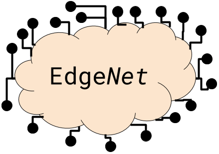

---
---

# Welcome to EdgeNet!

EdgeNet is a distributed edge cloud, in the family of
[PlanetLab](https://planet-lab.org),
[GENI](https://geni.net),
[JGN-X](https://www.jgn.nict.go.jp/english/index.html),
and [PlanetLab Europe](https://www.planet-lab.eu/).
It is a modern distributed edge cloud, incorporating
advances in Cloud technologies over the past few years.

EdgeNet is based on *industry-standard Cloud software*, with
[Docker](https://www.docker.com/) as the containerization
technology and [Kubernetes](https://kubernetes.io/) as the
node manager and deployment solution.  It is an *opt-in* global
Kubernetes cluster; once a user has authenticated with this portal and
been approved, she will be able to use standard Kubernetes tools and
technologies to deploy an application across the EdgeNet
infrastructure.

### To use EdgeNet, please proceed to the [EdgeNet Portal](https://sundewcluster.appspot.com/).

# Design Goal

EdgeNet is a software-only infrastructure. Its design goal is that any
local virtual machine with Internet connectivity should be able to join
the EdgeNet worldwide infrastructure in under five minutes, and any developer
should be able to deploy his application across EdgeNet using standard,
familiar Cloud technologies within five minutes.

To reach this goal, EdgeNet is based on the popular
[Kubernetes](https://kubernetes.io/)
container orchestration software, and can be controlled using the
Kubernetes Dashboard and `kubectl` command-line tool.
EdgeNet provides Ubuntu 16.04 worker nodes to its users.

# Status
  
As of June 2018, EdgeNet is under active development. A prototype
with around 30 worker nodes from around the world is accessible to
the public via the [EdgeNet Portal](https://sundewcluster.appspot.com/).
Please see [our space on GitHub](https://github.com/EdgeNet-Project)
for up-to-date information!
